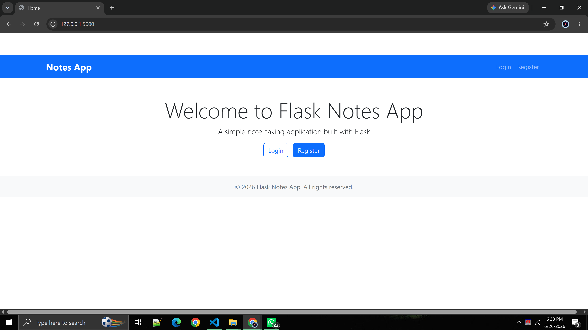
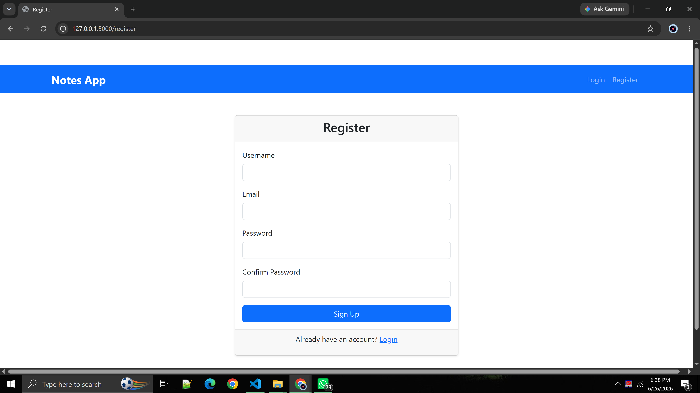
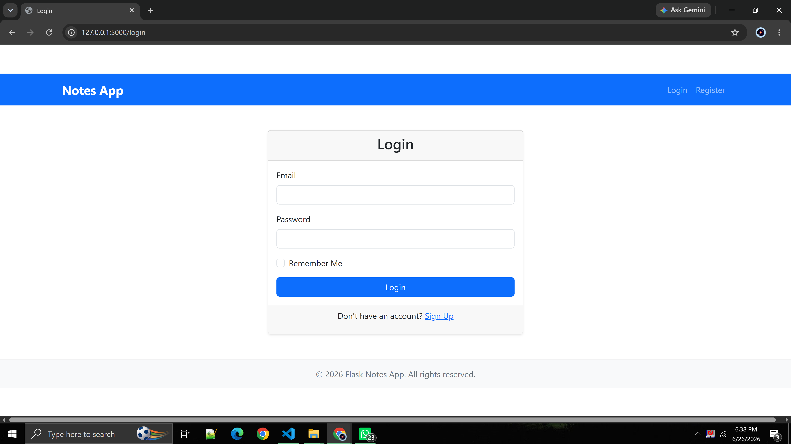
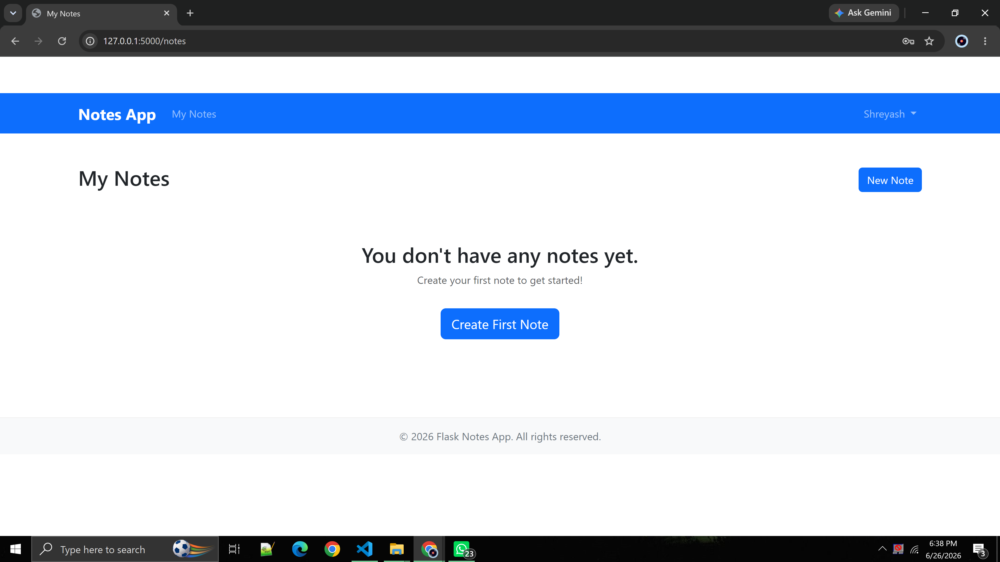
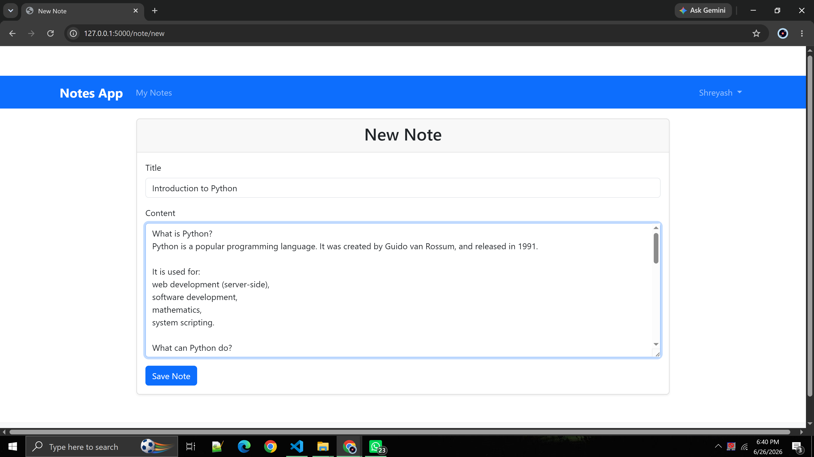
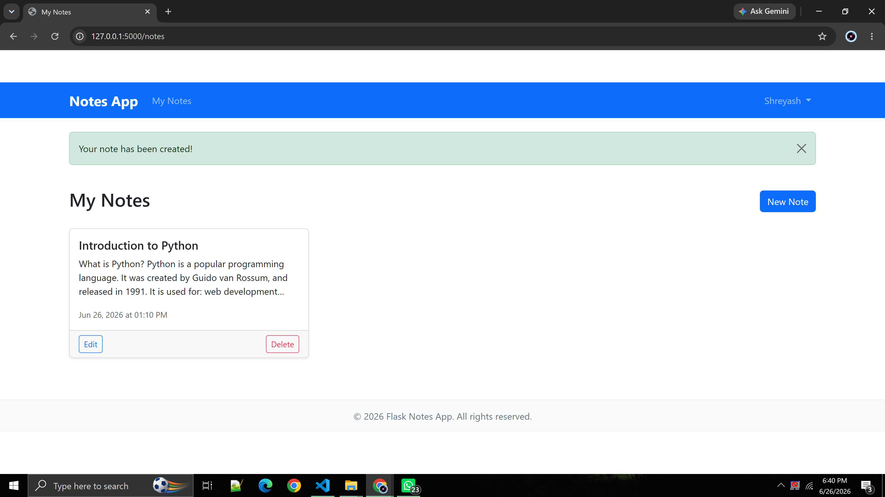

# Flask Notes App

A simple note-taking web application built with Flask.

## Features

- User registration, login, and logout
- Secure password hashing using Werkzeug
- Session management with Flask-Login
- Create, view, edit, and delete notes
- Responsive design with Bootstrap 5
- SQLite database for storage using Flask-SQLAlchemy
- Form validation with Flask-WTF and email-validator
- Comprehensive unit tests

## Setup

1. Clone the repository
2. Install dependencies:
   ```
   pip install -r requirements.txt
   ```
3. Run the application:
   ```
   python app.py
   ```
4. Open your browser to `http://localhost:5000`

## Running Tests

To run the unit tests:
```
python -m unittest discover -s tests
```

## Project Structure

- `app.py`: Main Flask application
- `models.py`: Database models (User, Note)
- `forms.py`: WTForms forms (Registration, Login, Note)
- `templates/`: HTML templates (base, home, login, register, notes, create_note)
- `static/css/`: CSS styles
- `tests/`: Unit tests (test_models.py, test_routes.py, test_basic.py)
- `requirements.txt`: Python dependencies
- `README.md`: This file

## Features in Detail

### Authentication
- Users can register with a username, email, and password
- Passwords are securely hashed using Werkzeug's password hashing
- Users can log in and log out
- Session management prevents unauthorized access to protected routes

### Notes Functionality
- Authenticated users can create new notes with a title and content
- Users can view all their notes on the dashboard
- Users can edit existing notes
- Users can delete notes
- Notes are timestamped with creation date

### Security
- CSRF protection enabled for forms
- Passwords are hashed (never stored in plain text)
- Users can only access their own notes
- Proper error handling for unauthorized access

## License

This project is licensed under the MIT License.

## 📸 Project Screenshots

### 🏠 Home Page



---

### 👤 User Registration



---

### 🔐 User Login



---

### 📝 Notes Dashboard



---

### ➕ Create a New Note



---

### ✏️ Edit & 🗑️ Delete Note

